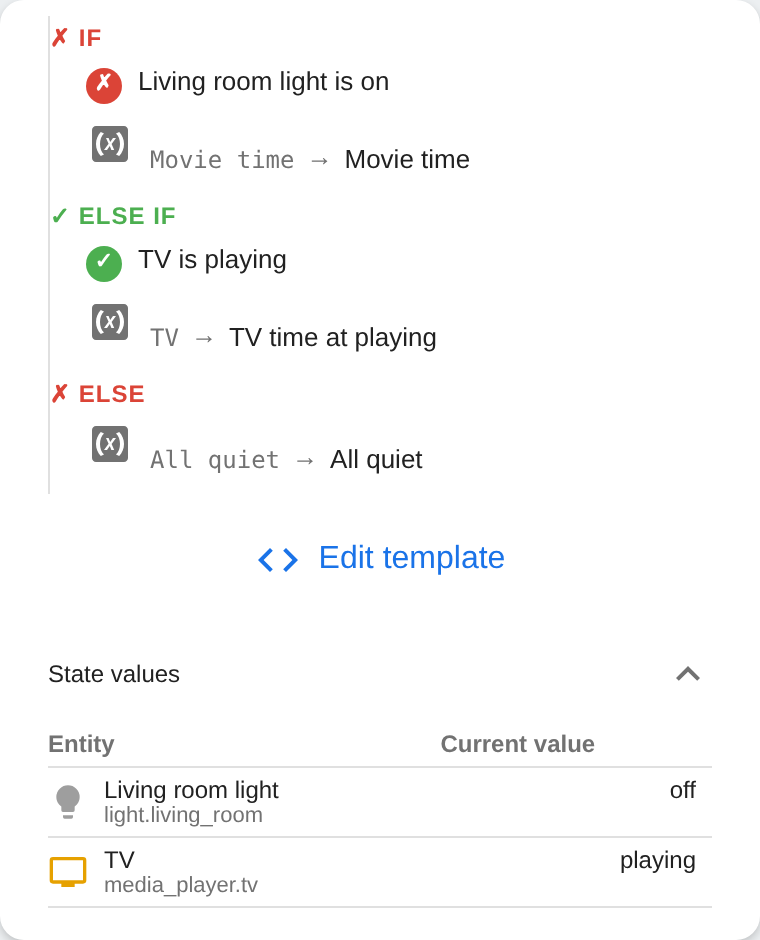

# Template Visualizer (Home Assistant custom card)

[](https://github.com/jan-rivo/ha-template-visualizer-card/actions/workflows/validate.yml)
[](https://github.com/hacs/integration)
[](LICENSE)

See *why* your template sensor outputs what it outputs. Template Visualizer
parses a Template Helper's Jinja logic and renders it as a live tree — every
condition badged ✓/✗ against your real entity states, updating instantly when
anything changes.

<picture>
  <source media="(prefers-color-scheme: dark)" srcset="docs/screenshot-dark.png">
  
</picture>

- **Live logic tree** — `` / `` / `` branches and
  `and` / `or` / `not` conditions, each with a live pass/fail badge and its
  current rendered value. No polling: every value is a push subscription.
- **Edit in place** (admins) — tweak the template right on the card with a
  live-updating preview, then save straight back to the helper.
- **State values panel** — every entity the template reads, with friendly
  name, icon and current value.
- **Zero config drift** — point the card at a helper; it reads the helper's
  actual template itself. Nothing to paste or keep in sync.

## Requirements

Works with entities created via **Settings → Devices & Services → Helpers →
Template** (UI-based Template Helpers). YAML-defined `template:` sensors are
not supported — Home Assistant exposes no API to read their definition, so
there is nothing for the card to visualize. See [Limitations](#limitations).

## Installation

### HACS (recommended)

1. In Home Assistant, go to **HACS → top-right menu → Custom repositories**,
   add this repository's URL as a **Dashboard** repository.
2. Install **Template Visualizer** from HACS (enable *Show beta versions* for
   pre-releases). HACS adds the Lovelace resource automatically.

### Manual

1. Copy `dist/ha-template-visualizer-card.js` into your HA `www/` folder and
   add it as a Lovelace resource:
   ```yaml
   resources:
     - url: /local/ha-template-visualizer-card.js
       type: module
   ```

## Usage

Add the card (**Add Card → Template Visualizer**) and pick a Template Helper
— or configure it in YAML:

```yaml
type: custom:ha-template-visualizer-card
title: Movie mode logic
entity: binary_sensor.movie_mode
```

| Option | Type | Default | Description |
|---|---|---|---|
| `entity` | string | — | **Required.** A UI-created Template Helper entity. |
| `title` | string | `Template logic` | Card header title. |
| `icon` | string | `mdi:ab-testing` | Card header icon. |
| `showCode` | boolean | `false` | Show raw template code instead of human-readable conditions. |
| `showReferences` | boolean | `true` | Show the State values panel. |
| `showHeader` | boolean | `true` | Show the header icon + title. |
| `showEditButton` | boolean | `true` | Show the Edit template button (admin users only). |

## Supported templates

- Boolean logic: `and`, `or`, `not`, parentheses
- Comparisons and function calls (`states()`, `is_state()`, `state_attr()`,
  `float()`, …) as conditions
- `` / `` / `` branches, `` variables

Anything beyond that still works — it is shown as a single live-evaluated
expression, just without the sub-condition breakdown.

## Limitations

- **UI helpers only** (see Requirements). The card reads the helper's
  template through the same options flow HA's own edit dialog uses. That is a
  semi-internal mechanism, not a documented API: it can break across Home
  Assistant updates. If it does, the card shows a clear error instead of
  failing silently.
- **Saving requires an admin user.** The Edit button is hidden for non-admins
  (HA itself rejects the write server-side).
- Minimum Home Assistant version: see `homeassistant` in `hacs.json`.

## Contributing

Issues and pull requests are welcome — please include your Home Assistant
version and the template text when reporting a bug.

```bash
npm install
npm run build      # bundles to dist/ha-template-visualizer-card.js
npm run typecheck
npm test           # unit tests (node:test via tsx)
```

`dist/` is committed: run `npm run build` before pushing (CI fails otherwise).

## Acknowledgments

This card was developed with AI assistance.

## License

[MIT](LICENSE)
